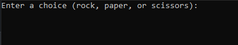
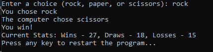
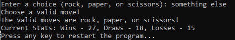

# Rock-Paper-Scissors Gam

A simple rock-paper-scissors game with basic statistics tracking.

## Introduction

This project is a command-line implementation of the classic rock-paper-scissors game. Players can make a move, and the computer opponent will randomly choose a move. The game outcome is displayed, and statistics (wins, draws, losses) are tracked.

## Screenshots

